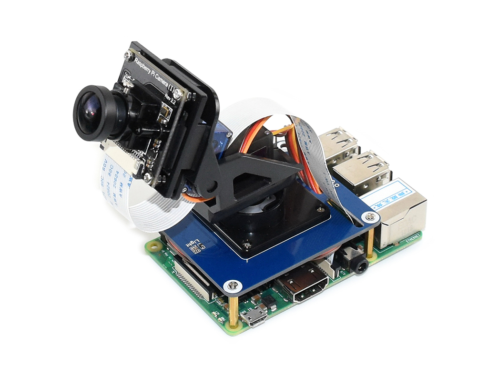

# Pan-Tilt HAT  
## waveshare electronics

http://www.waveshare.net  
https://www.waveshare.com  

## 中文 ## 
http://www.waveshare.net/shop/Pan-Tilt-HAT.htm  
专为树莓派接口设计的两自由度云台扩展板，板载PCA9685芯片和TSL2581环境光传感器，通过I2C接口控制即可实现云台转动和光强检测。  
适用于：  
Raspberry Pi Zero/Zero W/Zero WH/2B/3B/3B+  
Jetson Nano

## English ##
https://www.waveshare.com/pan-tilt-hat.htm  
The two-degree-of-freedom PTZ expansion board designed for the Raspberry Pi interface, the onboard PCA9685 chip and the TSL2581 ambient light sensor can realize pan/tilt rotation and light intensity detection through I2C interface control.  
Applicable to:  
Raspberry Pi Zero/Zero W/Zero WH/2B/3B/3B+  
Jetson Nano

